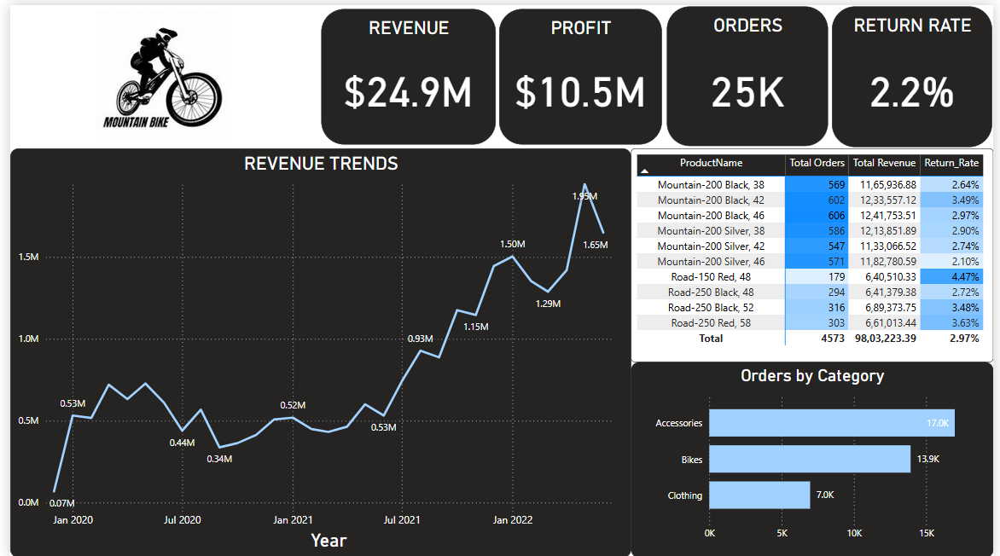
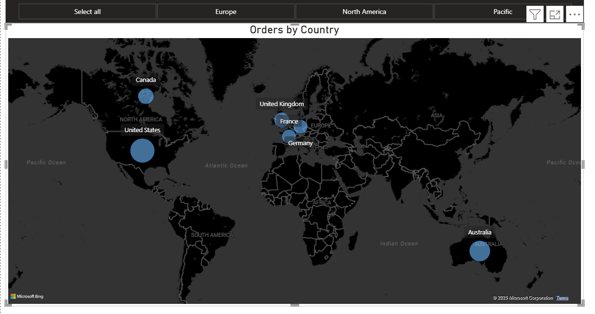

## Overview

This repository contains a sales dashboard that visualizes key business metrics such as revenue, profit, order volume, and return rates. The dashboard provides insights into sales trends and product performance.

## Features

Revenue & Profit Tracking: Displays total revenue ($24.9M) and profit ($10.5M).

Orders & Return Rate: Shows the total number of orders (25K) and return rate (2.2%).

Revenue Trends: Line chart tracking revenue growth over time.

Product Performance: Table displaying sales and return rates for individual products.

Category-wise Orders: Bar chart visualizing orders by category (Accessories, Bikes, Clothing).

## Data Sources

The data used in this dashboard comes from sales records, including order details, revenue, and return rates.

## Tools & Technologies

&nbsp;

Visualization Tool: Power BI (or any BI tool used for analysis)

Data Source: CSV, SQL, or any database containing sales data

Programming Languages (if applicable): Python, SQL, or DAX for data processing

## Future Enhancements

Add filters for product categories and time periods.

Integrate real-time data updates.

Enhance UI with additional metrics and visualizations.

## Dashboard

&nbsp;
&nbsp;

